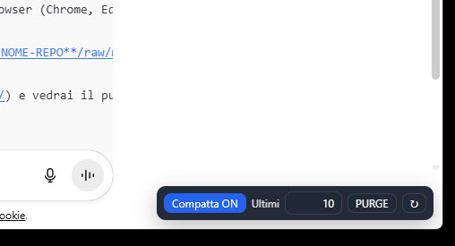

# ChatGPT DOM Compactor (Tampermonkey UserScript)

Uno script **Tampermonkey** per velocizzare ChatGPT quando le chat diventano molto lunghe.  
Mantiene visibili solo gli ultimi **N messaggi** ed elimina (o nasconde) i precedenti dal DOM, così il browser rimane fluido anche con conversazioni infinite.  

👉 Funziona sia su **chat.openai.com** che su **chatgpt.com**.

---

## ✨ Funzionalità
- Modalità **HIDE** → i messaggi vecchi vengono nascosti (`display:none`).  
- Modalità **PURGE** → i messaggi vecchi vengono proprio rimossi dal DOM.  
- Imposta quanti messaggi mantenere (es. 30, 50, 100).  
- Pulsantino compatto in basso a destra con controlli rapidi.  
- Scorciatoia da tastiera: **Ctrl+Shift+K** per attivare/disattivare.  
- Aggiorna il titolo della scheda con il numero di messaggi visibili (`[42] ChatGPT ...`).  

---

## 📦 Installazione
1. Installa l’estensione [Tampermonkey](https://www.tampermonkey.net/) sul tuo browser (Chrome, Edge, Firefox, ecc.).  
2. Clicca su questo link per installare lo script:  
   👉 [**Installa ChatGPT DOM Compactor**](https://github.com/**TUO-USERNAME**/**NOME-REPO**/raw/main/chatgpt-dom-compactor.user.js)  
   *(si aprirà Tampermonkey e ti chiederà conferma)*  
3. Vai su [ChatGPT](https://chat.openai.com/) o [chatgpt.com](https://chatgpt.com/) e vedrai il pulsantino in basso a destra.  

---

## ⚙️ Configurazione
- **Ultimi messaggi**: scegli quanti tenere visibili (default: 50).  
- **Modalità**:  
  - `HIDE` = nasconde i vecchi messaggi (puoi ripristinarli senza ricaricare).  
  - `PURGE` = rimuove i vecchi messaggi (massima leggerezza, tornano solo al refresh).  

---

## 📸 Anteprima
Menu: 

---

## 📜 Licenza
Rilasciato sotto licenza MIT – sentiti libero di usarlo, modificarlo e condividerlo.  

---

💡 Utile per chi usa ChatGPT in conversazioni lunghe (studio, lavoro, codice) e non vuole rallentamenti nel browser.
